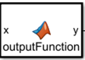
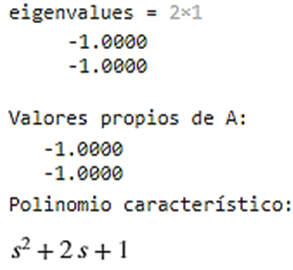
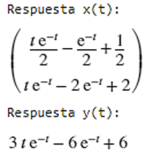
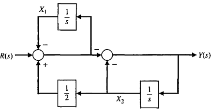
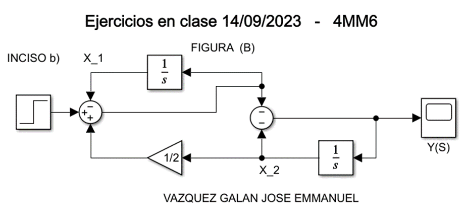
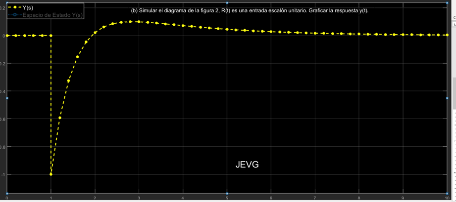
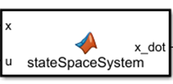
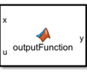
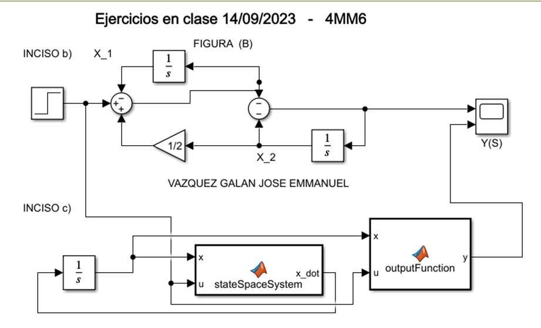
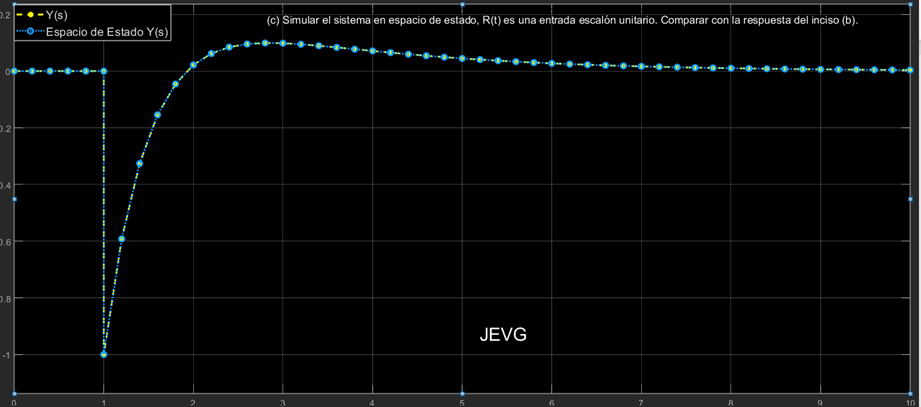

# Analysis of systems in state variables

## 1. A system is represented by the block diagram in Figure 1.

            

     
    <strong><em>  
Figure 1. Block Diagram    </em></strong>

## (a) Obtain the state space representation of the form:

- $$\dot{x} = Ax + Bu$$
  
- $$y = Cx$$ 

With the following equations:

$$ \dot{x}_2 = -dx_2 - kfx_2 + fu(t) + ax_1 $$

$$ \dot{x}_2 = -(kf + d) x_2 + fu + ax_1 $$

$$ \dot{x}_1 = u(t) - kx_2 $$

$$ y = bx_2 $$

Matrix representation:

$$ x(t) = \begin{bmatrix} x_1(t) \\ x_2(t) \end{bmatrix} $$

$$ \dot{x}(t) = \begin{bmatrix} 0 & -k \\ a & -(fk + d) \end{bmatrix} x(t) + \begin{bmatrix} 1 \\ f \end{bmatrix} u(t) $$

$$ y = [0 \quad b] x(t) $$

## (b) Plot Simulation
Simulate the diagram in Figure 1, with a = 2, b = 3, d = 1/2, k = 1/2, f = 3, u(t) is a unit step input. Plot the response y(t).

            

     
    <strong><em>  
Simulink, Block diagram simulation 
    </em></strong>

            

     
    <strong><em>  
System response y(t)
    </em></strong>

## (c) State Space System Simulation

Simulate the system with the following parameters: a = 2, b = 3, d = 1/2, k = 1/2, f = 3, where \( u(t) \) is a unit step input. Compare with the answer in (b).

To perform the simulation we use the state space representation:

$$x(t) = \begin{bmatrix} x_1(t) \\ x_2(t) \end{bmatrix}$$

$$\dot{x}(t) = \begin{bmatrix} 0 & -k \\ a & -(fk + d) \end{bmatrix} x(t) + \begin{bmatrix} 1 \\ f \end{bmatrix} u(t)$$

$$y = [0 \quad b] x(t)$$

The integration and configuration in Simulink is addressed as follows:

1.  **Integration**: 
    - An `Integrator` block is used to perform numerical integration of the input signal with respect to time, integrating the derivative of the state to obtain the current state.
2. **Matrix A and B**: 
    - With a *"MATLAB Function"* block named `stateSpaceSystem`, custom MATLAB code can be written to accept inputs and produce outputs within the Simulink model.

        

    - *x_dot = Ax + Bu*: This is the differential equation representing the system in state space. Here, "A and B" are matrices describing the dynamics of the system, "x" is the state vector and "u" is the input to the system.
3. **Output "y"**
    - *"MATLAB Function" outputFunction block*:  y = C*x: This is the equation that relates the state vector "x" to the output "y". "C" is a matrix that describes how the output is formed from the state vector.

        

4. **Input**: 
    - *A "Step" block* produces a step signal, which represents \( u(t) \) as a unit step input.

Illustrations of the results:

            

     
    <strong><em>  
State-space system
    </em></strong>

            

     
    <strong><em>  
System response in state space
    </em></strong>

## (d) Obtaining the State Vector (x(t) and the System Response (y(t))

Apply the general formula for a system with zero initial conditions and \( u(t) \) as a unit step input:

$$x(t) = \mathcal{L}^{-1} \{ (sI - A)^{-1} \} x(0) + \mathcal{L}^{-1} \{ (sI - A)^{-1} BU(s) \}$$

$$y(t) = Cx(t)$$

1. Equations of state and Laplace Transform:

* The system is represented by its equations of state: x ̇(t)=Ax(t)+Bu(t),y(t)=Cx(t).
* The Laplace transform of a unit step input u(t) is U(s)=1/s.
	
2. Find X(s):

* Using the state space equation and the Laplace transform, we can express X(s) as: 
$$X(s)=\mathcal(sI-A)^{-1} x(0)+(sI-A)^{-1} BU(s)$$ 
* Here, x(0) represents the initial conditions, which in this case are zero.

3. Solution in MATLAB stateResponse:
	
* MATLAB symbolic tools are used to compute `X(s)` and `y(t)` given matrices A, B, and C.
* The `ilaplace` and `inv` functions are used to perform the inverse Laplace transform and compute the inverse of a matrix, respectively.
* The homogeneous and particular responses are computed separately and then summed to obtain the total response.
* Finally, the answers are converted to anonymous functions to facilitate numerical evaluation at later stages.

            

     
    <strong><em>  
Response of the system x1(t), x2(t) and y(t) in isolation (without the displacement of the step at the beginning).    </em></strong>

### (e) Simulación del Vector de Estado \( x(t) \) y la Respuesta del Sistema \( y(t) \)

We chose to compare the signals by sending the answers of the previous paragraph to simulink through the use of Anonymous Functions:

1. **Creation and Use of Anonymous Functions:**
- Initially, anonymous functions specific to the system to be simulated were generated. These functions are numerical representations of the responses x1(t), x2(t) and y(t).
- To facilitate their use in Simulink, we created the function stateResponse. This function, given a time input, returns the respective responses x1(t), x2(t) and y(t) of the system. It is important to note that the responses before t=1 are set to be zero, which is a specificity of our system when using an input as a unit step.
2.	**Configuration in Simulink:**
- We enter a "MATLAB Function" block in the work area.
- We enter the code that will call the necessary functions from the MATLAB code. This code invokes the function `stateResponse` which calculates the responses as a function of time t.
- We connect a "Clock" block to the t input of the "MATLAB Function" block. The purpose of the "Clock" block is to supply the current simulation time to the function block, which in turn determines the system responses.
- To visualize the outputs of the system, we connect the outputs x1, x2 and y of the "MATLAB Function" block to our overall scope. 

            

     
    <strong><em>  
Simulation of the state vector x(t) and the response of the system y(t)
    </em></strong>

            

     
    <strong><em>  
Comparing the initial output of the system with x1(t), x2(t) and y(t) by adding step
   </em></strong>

### (f) Controlabilidad del Sistema

A code was generated, which will first calculate the controllability matrix CK and check if the system is controllable using the Kalman criterion. Then, it will use the Hautus criterion to verify if the system is controllable by evaluating the rank of the matrix Hc in the eigenvalues of A. 
Next, controllability is verified using state feedback. Finally, the controllability Gramian is determined and its determinant is evaluated.  
 
 

- **Kalman Controllability Criterion:**
The controllability matrix CK was determined to have full rank (rank equal to 2, which is the dimension of the system). In addition, the determinant of CK is non-zero. These two indicators are consistent with a controllable system according to the Kalman criterion.

- **Hautus Controllability Criterion:**
It was verified that for the eigenvalues of A (which are -1-1 and -1-1), the matrix Hc maintains its full rank (rank equal to 2). Therefore, the system is controllable according to the Hautus criterion.

- **Controllability Gramian criterion:**
The determinant of the controllability Gramian is 0.01560.0156, which is non-zero. This indicates that the system is controllable, as a controllability Gramian with nonzero determinant is another indication of a controllable system.

- **System response:**
The response of the system x(t) and y(t) also supports controllability. The response shows exponentially decaying dynamics, which is consistent with the eigenvalues obtained. Furthermore, the ability to model and obtain a specific response suggests that the system can be influenced by a control input.

***In conclusion,*** *from the above criteria and the results provided, we can justify that the system is controllable. That is, it is possible to steer the system from any initial state to any final state in a finite time using a suitable control input.*

### (g) Estabilidad del Sistema

The stability of a system is a property that tells us how the system responds to an initial perturbation or input. To determine if a system is stable, we examine the locations of its poles (eigenvalues of the matrix A) in the complex plane.
We will analyze the stability of the system based on the information discussed above:

1. **Eigenvalues of the matrix A:**
    - The eigenvalues of A are -1-1 and -1-1. These eigenvalues (or poles of the system) are in the left half plane of the complex plane. For a continuous linear system to be stable, all its poles must be in the left half plane. In this case, both poles are at -1-1, indicating that the system is stable.

2. **Response of the system:**
    - The responses x(t) and y(t) also support the stability of the system. Both responses contain terms that decay exponentially with time (e-t). This is a characteristic of stable systems. There are no terms that grow indefinitely with time.
	- Characteristic polynomial and transfer function:
	The characteristic polynomial is s^2+2s+1, which has roots at s=-1 (repeated poles). These roots coincide with the eigenvalues of A, which we have already discussed.
	The transfer function also reflects the stability of the system, since its denominator (containing the poles of the system) has no roots in the right half-plane.

*Therefore, the system is stable. This is justified by the fact that all the eigenvalues of the matrix A are in the left half-plane of the complex plane. Furthermore, the time responses x(t) and y(t) decay exponentially with time, which is consistent with a stable system.*

## 2. A system is represented by the block diagram in Figure 2.

            

     
    <strong><em>  
Figure 2. Block Diagram    </em></strong>

## (a) Obtain the state space representation of the form:

- $$\dot{x} = Ax + Bu$$
  
- $$y = Cx$$ 

Matrix representation:

$$ x(t) = \begin{bmatrix} x_1(t) \\ x_2(t) \end{bmatrix} $$

$$ \dot{x}(t) = \begin{bmatrix} -1 & 1/2 \\ 1 & -3/2 \end{bmatrix} x(t) + \begin{bmatrix} 1 \\ -1 \end{bmatrix} u(t) $$

$$ u(t)=R $$

$$ y = [1 \quad -3/2] x(t) + (-1)u $$

## (b) Plot Simulation
Simulate the diagram of figure 2, R(t) is a unit step input. Plot the response y(t).

            

     
    <strong><em>  
Simulink, Block diagram 2 simulation 
    </em></strong>

            

     
    <strong><em>  
System response y(t)
    </em></strong>

## (c) State Space System Simulation

R(t) is a unit step input. Compare with the answer of (b).

To carry out the simulation of the system in state space, we start from: 

$$x(t) = \begin{bmatrix} x_1(t) \\ x_2(t) \end{bmatrix}$$

$$ \dot{x}(t) = \begin{bmatrix} -1 & 1/2 \\ 1 & -3/2 \end{bmatrix} x(t) + \begin{bmatrix} 1 \\ -1 \end{bmatrix} u(t) $$

$$ y = [1 \quad -3/2] x(t) + (-1)u $$

So we can approach the system as follows: 

1.  **Integration**: 
    - An `Integrator`.  This block performs the numerical integration of the input signal with respect to time. In the state space context, it integrates the derivative of the state to obtain the current state.
2. **Matrix A and B**: 
    - With a *"MATLAB Function"* block named `stateSpaceSystem`. It allows us to write custom MATLAB code that can accept inputs and produce outputs in your Simulink model. 

        

    - *x_dot = Ax + Bu*: This is the differential equation that represents the system in state space. Here, "A and B" are matrices describing the dynamics of the system, "x" is the state vector and "u" is the input to the system.
3. **Output "y"**
    - **y = C*x-u:** This is the equation relating the state vector "x" to the output "y". "C" is a matrix describing how the output is formed from the state vector, and there is a direct contribution of -1 multiplied by the input u(t).
    
    These functions allow to simulate the behavior of the system in MATLAB, under certain initial conditions and an input signal u(t).

    

4. **Input**: 
    - *A "Step" block*. This block produces a step signal. In the context of the problem, this represents a unit step u(t).

Resulting in: 
The matrices A, B, and C: 

$$ A = \begin{bmatrix} -1 & 1/2 \\ 1 & -3/2 \end{bmatrix} ; B = \begin{bmatrix} 1 \\ -2 \end{bmatrix} ; C =  [1 -3/2] $$

            

     
    <strong><em>  
State-space system 2
    </em></strong>

            

     
    <strong><em>  
System 2 response in state space
    </em></strong>

## (d) Obtaining the State Vector (x(t) and the System Response (y(t))

Apply the general formula for a system with zero initial conditions and \( u(t) \) as a unit step input:

$$x(t) = \mathcal{L}^{-1} \{ (sI - A)^{-1} \} x(0) + \mathcal{L}^{-1} \{ (sI - A)^{-1} BU(s) \}$$

$$y(t) = Cx(t)$$

1. Equations of state and Laplace Transform:

* The system is represented by its equations of state: x ̇(t)=Ax(t)+Bu(t),y(t)=Cx(t).
* The Laplace transform of a unit step input u(t) is U(s)=1/s.
	
2. Find X(s):

* Using the state space equation and the Laplace transform, we can express X(s) as: 
$$X(s)=\mathcal(sI-A)^{-1} x(0)+(sI-A)^{-1} BU(s)$$ 
* Here, x(0) represents the initial conditions, which in this case are zero.

3. Solution in MATLAB stateResponse:
	
* MATLAB symbolic tools are used to compute `X(s)` and `y(t)` given matrices A, B, and C.
* The `ilaplace` and `inv` functions are used to perform the inverse Laplace transform and compute the inverse of a matrix, respectively.
* The homogeneous and particular responses are computed separately and then summed to obtain the total response.
* Finally, the answers are converted to anonymous functions to facilitate numerical evaluation at later stages.

            

     
    <strong><em>  
Response of the system x1(t), x2(t) and y(t) in isolation (without the displacement of the step at the beginning).    </em></strong>

### (e) Simulación del Vector de Estado \( x(t) \) y la Respuesta del Sistema \( y(t) \)

We chose to compare the signals by sending the answers of the previous paragraph to simulink through the use of Anonymous Functions:

1. **Creation and Use of Anonymous Functions:**
- Initially, anonymous functions specific to the system to be simulated were generated. These functions are numerical representations of the responses x1(t), x2(t) and y(t).
- To facilitate their use in Simulink, we created the function stateResponse. This function, given a time input, returns the respective responses x1(t), x2(t) and y(t) of the system. It is important to note that the responses before t=1 are set to be zero, which is a specificity of our system when using an input as a unit step.
2.	**Configuration in Simulink:**
- We enter a "MATLAB Function" block in the work area.
- We enter the code that will call the necessary functions from the MATLAB code. This code invokes the function `stateResponse` which calculates the responses as a function of time t.
- We connect a "Clock" block to the t input of the "MATLAB Function" block. The purpose of the "Clock" block is to supply the current simulation time to the function block, which in turn determines the system responses.
- To visualize the outputs of the system, we connect the outputs x1, x2 and y of the "MATLAB Function" block to our overall scope. 

            

     
    <strong><em>  
Simulation of the state vector x(t) and the response of the system y(t)
    </em></strong>

            

     
    <strong><em>  
Comparing the initial output of the system with x1(t), x2(t) and y(t) by adding step
   </em></strong>

### (f) Controlabilidad del Sistema

A code was generated, which will first calculate the controllability matrix CK and check if the system is controllable using the Kalman criterion. Then, it will use the Hautus criterion to verify if the system is controllable by evaluating the rank of the matrix Hc in the eigenvalues of A. 
Next, controllability is verified using state feedback. Finally, the controllability Gramian is determined and its determinant is evaluated.  
 
 

- **Kalman Controllability Criterion:**
The controllability matrix CK was determined to have full rank (rank equal to 2, which is the dimension of the system). In addition, the determinant of CK is non-zero. These two indicators are consistent with a controllable system according to the Kalman criterion.

- **Hautus Controllability Criterion:**
It was verified that for the eigenvalues of A (which are -1-1 and -1-1), the matrix Hc maintains its full rank (rank equal to 2). Therefore, the system is controllable according to the Hautus criterion.

- **Controllability Gramian criterion:**
The determinant of the controllability Gramian is 0.01560.0156, which is non-zero. This indicates that the system is controllable, as a controllability Gramian with nonzero determinant is another indication of a controllable system.

- **System response:**
The response of the system x(t) and y(t) also supports controllability. The response shows exponentially decaying dynamics, which is consistent with the eigenvalues obtained. Furthermore, the ability to model and obtain a specific response suggests that the system can be influenced by a control input.

***In conclusion,*** *from the above criteria and the results provided, we can justify that the system is controllable. That is, it is possible to steer the system from any initial state to any final state in a finite time using a suitable control input.*

### (g) Estabilidad del Sistema

The stability of a system is a property that tells us how the system responds to an initial perturbation or input. To determine if a system is stable, we examine the locations of its poles (eigenvalues of the matrix A) in the complex plane.
We will analyze the stability of the system based on the information discussed above:

1. **Eigenvalues of the matrix A:**
    - The eigenvalues of A are -1-1 and -1-1. These eigenvalues (or poles of the system) are in the left half plane of the complex plane. For a continuous linear system to be stable, all its poles must be in the left half plane. In this case, both poles are at -1-1, indicating that the system is stable.

2. **Response of the system:**
    - The responses x(t) and y(t) also support the stability of the system. Both responses contain terms that decay exponentially with time (e-t). This is a characteristic of stable systems. There are no terms that grow indefinitely with time.
	- Characteristic polynomial and transfer function:
	The characteristic polynomial is s^2+2s+1, which has roots at s=-1 (repeated poles). These roots coincide with the eigenvalues of A, which we have already discussed.
	The transfer function also reflects the stability of the system, since its denominator (containing the poles of the system) has no roots in the right half-plane.

*Therefore, the system is stable. This is justified by the fact that all the eigenvalues of the matrix A are in the left half-plane of the complex plane. Furthermore, the time responses x(t) and y(t) decay exponentially with time, which is consistent with a stable system.*

## General Conclusion

In this practice, we have carried out a comprehensive analysis of systems represented in state variables. Two different systems were examined, both of which were initially represented through block diagrams.
For each system:
1. their state-space representation was determined, which allowed the behavior of the system to be described using a set of first-order differential equations in matrix form.
2. Simulations were carried out based on both the original block diagram and its state-space representation. The responses of these simulations, in particular y(t), were compared to validate the accuracy and consistency of the model.
Using the general formula, the state vector x(t) and the system response y(t) were calculated. These results were then simulated and compared with previously obtained responses to ensure consistency.
Using the general formula, the state vector x(t) and the system response y(t) were calculated. These results were then simulated and compared with previously obtained responses to ensure consistency.
4.	The controllability of the system was evaluated. In our discussion, we determined that the system is controllable based on criteria such as Kalman and Hautus. This controllability indicates that the system can be taken from any initial state to any final state by means of a suitable control input in a finite time.
5.	The stability of the system was analyzed. Criteria based on pole location and time response revealed that the system is stable. This is a vital indicator, since it tells us that, in the face of perturbations, the system will return to a stable state without presenting infinite oscillations.

Throughout this practice, the importance of the state variable representation was highlighted, not only as a theoretical tool, but also as a practical tool that allows simulations, controllability and stability analysis, and other critical evaluations. It is evident that, for systems and control engineering, state space analysis is an essential technique that provides a deep and mathematically rigorous understanding of the behavior of dynamic systems.

### Reference
- Mata Machuca, J. L. (2024). Class presentations: Control of Mechatronic Systems. UPIITA, National Polytechnic Institute. School year 2024-1.