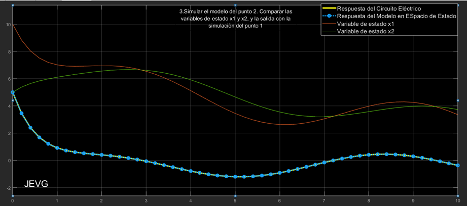

## Controllable Canonical Form and Observable Canonical Form

Consider the electrical circuit in Figure 1, where \( x_1 \) and \( x_2 \) are the values at capacitors \( C_1 \) and \( C_2 \), respectively.

<p align="center">            

    <br>
    <strong><em>  
Circuit simulation diagram 
    </em></strong>
</p>

The input is a variable voltage source \( u \), and the output is \( y = x_1 - x_2 \). The parameters are: \( R_1 = 5 \Omega), \( R_2 = 10 \Omega), \( R_3 = 1 \Omega), \( C_1 = 1 F \), \( C_2 = 2 F \), \( u = \sin(t) V \), with initial conditions \( x_1(0) = 10 \) and \( x_2(0) = 5 \).

### 1. Perform the Electrical Circuit Simulation.

<p align="center">            

    <br>
    <strong><em>  
Simulink simulation of the circuit.
    </em></strong>
</p>

<p align="center">            

    <br>
    <strong><em>  
Response y(t) without initial conditions
    </em></strong>
</p>

<p align="center">            

    <br>
    <strong><em>  
Response y(t) with initial conditions x_1 (0)=10 and x_2 (0)=5
    </em></strong>
</p>


### 2. Get the Model in State Space

Using the node method:

$$ frac{Y}{R_3} - C_2 \dot{X}_2 + \frac{(U - X_2)}{R_2} = 0 $$
$$  \frac{(X_1 - X_2)}{R_3} - C_2 \dot{X}_2 + \frac{(U - X_2)}{R_2} = 0  $$
$$ \dot{X}_2 = \frac{(X_1 - X_2)}{(C_2 R_3)} + \frac{(U - X_2)}{(C_2 R_2)} = 0 
$$
$$  \dot{X}_1 = \frac{X_1}{(C_2 R_2)} - \frac{X_2}{(C_2 R_3)} + \frac{Y}{(C_2 R_2)} - \frac{X_2}{(C_2 R_2)} 
$$
$$  \dot{X}_2 = \frac{Y}{(C_2 R_2)} + \frac{1}{(C_2 R_2)} X_1 - \frac{(C_2 R_2 + C_2 R_3)}{(C_2 R_2 R_2 R_3)} X_2 
$$


Passing to state space, of the form \( \dot{x} = Ax + Bu \); \( y = Cx \):

The state-space representation of the system is given by the following equation:

$$
\dot{x} = \begin{bmatrix}
-\frac{C_1 R_3 + C_1 R_1}{C_1^2 R_1 R_3} & \frac{1}{C_1 R_3} \\
\frac{1}{C_2 R_3} & -\frac{C_2 R_2 + C_2 R_3}{C_2^2 R_2 R_3}
\end{bmatrix}
\begin{bmatrix}
X_1 \\
X_2
\end{bmatrix}
+ \begin{bmatrix}
\frac{1}{C_1 R_1} \\
\frac{1}{C_2 R_2}
\end{bmatrix}
U
$$

where:

- $$ \dot{x}$$
    - is the derivative of the state vector \( x \),
- \( X_1 \) and \( X_2 \) are the states of the system,
- \( U \) is the input voltage source,
- \( R_1 \), \( R_2 \), \( R_3 \) are resistances,
- \( C_1 \), \( C_2 \) are capacitances.


$$  Y = [1 \quad -1] \begin{bmatrix} X_1 \end{bmatrix} X_2. 
$$


### 3.  Simulate the Model of Point 2

Compare the state variables \( x_1 \) and \( x_2 \), and the output with the simulation of point 1.

#### MATLAB function:

First, we define a function in MATLAB, `system_ss`, which takes as input the voltage \( u \), and the state variables \( x_1 \) and \( x_2 \). The function calculates the derivatives of the state variables and the output using state space matrices \( A ), \( B ), and \( C ).

In the function, we first define the circuit constants, such as resistances and capacitances. Subsequently, we set up the state space matrices using these constants.

Finally, we perform the computation of ( \dot{x} ):  $$ \dot{x}$$ and \( y \) using the standard state-space equations.

#### Simulink configuration:

In Simulink, the model is created using specific blocks:

- **"Matlab Function" block:** This block executes the `system_ss` function. It has three inputs: \( u \), \( x_1 \), and \( x_2 \), and three outputs: the derivatives \( \dot{x}_1 \); \( \( \dot{x}_2 \) and the output \( y \).
- **"Integrator" blocks:** Two integrator blocks that take \( \dot{x}_1 \); \( \( \dot{x}_2 \) as inputs and generate \( x_1 \) and \( x_2 \) as outputs. These blocks are essential since they integrate the derivatives to obtain the state variables over time.
- **"Scope" block:** To visualize and compare the state variables and the output with the results of point 1, the outputs "x_1", "x_2" and "y" are connected to this block.
- **Setting Initial Conditions:** Within the integrator blocks, we set the initial conditions for \( x_1 \) and \( x_2 \) (which are 10 and 5, respectively).

#### Simulation and Comparison:

Once the blocks are configured and the connections are established, we proceed to simulate the model. After the simulation, we visualize the trajectories of \( x_1 \), \( x_2 \), and \( y \) in the "Scope". 

These results can be directly compared to the results obtained in point 1 by superimposing the traces on the same scope or by using additional analysis and visualization tools in MATLAB.

- Illustration 4**: Simulation of the model in state space.
- Illustration 5**: Comparison of the response of the circuit \( y(t) \), with State Space model. Without initial conditions.
- Illustration 6**: Application of initial conditions to the system \( x_1(0) = 10) and \( x_2(0) = 5).
- Illustration 7**: Comparison of the response of the circuit \( y(t) \) with State Space model. With initial conditions.

<p align="center">            

    <br>
    <strong><em>  
State-space simulation of the model
    </em></strong>
</p>


<p align="center">            

    <br>
    <strong><em>  
Comparison of circuit response y(t), with State Space model.  Without initial conditions
    </em></strong>
</p>

<p align="center">            


    <br>
    <strong><em>  
Application of initial conditions to the system x_1 (0)=10 and x_2 (0)=5
    </em></strong>
</p>

<p align="center">            

    <br>
    <strong><em>  
Comparison of circuit response y(t) with State Space model. With initial conditions
    </em></strong>
</p>


### 4. Representing the System of Point 2 in the Controllable Canonical Form

Recall that a system is controllable if and only if it can move from any initial state \( x(0) \) to any final state \( x(T) \) in finite time \( T \) by appropriate choice of input \( u(t) \).

The controllability matrix \( Ct \) is defined as:

$$ Ct = [B, AB, A^2B, ..., A^{n-1}B]  $$

For a system to be controllable, the rank of this matrix must be equal to \( n \), which is the dimension of the system.

Now, assuming that the system is controllable, we can represent it in its controllable canonical form.

#### Transformation to Controllable Canonical Form:

- Calculate the controllability matrix \( Ct \).
- Find the inverse transformation matrix 
    - $$ Ct^{-1} $$
- Apply the transformation to the system matrices to obtain the controllable canonical form.

The transformed system will be:

$$ \dot{\tilde{x}} = \tilde{A}\tilde{x} + \tilde{B}u $$
$$ y = \tilde{C}\tilde{x} 
$$

Where:
$$  [\tilde{A} = T^{-1}AT]  ; [\tilde{B} = T^{-1}B]  ;  [\tilde{C} = CT]   $$

- ps=det⁡(s*eye(2)-A)
- a1=17/10;     a2=3/20;
- Pinv= [B A*B]x[1 a1 ;0 1]
- P=(Pinv)^(-1)     

- At=P*A*Pinv     ;     Bt=PB;        Ct=C*Pinv
    - sistema=ss(At,Bt,Ct,0)  


For this case, we obtain the following results, Calculation of the controllable canonical form:

- Successful verification: the system is controllable and the matrix \( Ct \) is invertible.

The calculated parameters are:

```plaintext
a1 = 17/10
a2 = 3/20
```

The transformation matrix P and the matrices in controllable canonical form are:

```plaintext
P = [6.6667 -6.6667; -2.2222 8.8889]
A_controlable = [-0.0000 -0.1600; 1.0000 -1.7500]
B_controlable = [1; 0]
C_controlable = [0.1500 -0.2625]
```

The system in the controllable canonical form is described by the object ss(At, Bt, Ct, 0) in MATLAB.

### 5. Simulate the System of Point 4
Compare the output with the simulation of point 1.

<p align="center">            

    <br>
    <strong><em>  
Simulation of the system in the controllable canonical form
    </em></strong>
</p>

<p align="center">            

    <br>
    <strong><em>  
Comparación de la respuesta del circuito y(t), forma canónica Controlable.  Sin condiciones iniciales
    </em></strong>
</p>

<p align="center">            

    <br>
    <strong><em>  
Application of initial conditions to the system x_1 (0)=10 and x_2 (0)=5. That is P*X(0)
    </em></strong>
</p>

<p align="center">            

    <br>
    <strong><em>  
Comparison of circuit response y(t), Controllable canonical form.  With initial conditions
    </em></strong>
</p>


### 6. Representing the System of Point 2 in the Observable Canonical Form

Consider a SISO (Single Input, Single Output) system described by:

1. $$ \begin{cases} \dot{x} = Ax + Bu y = Cx \end{cases}
$$

With its characteristic polynomial given by:

$$ p(s) = \det(sI - A) = s^n + a_1 s^{n-1} + a_2 s^{n-2} + \cdots + a_n $$

If this system is observable, then it can be represented in its canonical observable form (FCO) through an invertible state transformation \( x = S \{x} \), \( S \). The dynamics in the new coordinate \( S \x} \), is given by:

$$
\begin{aligned}
\tilde{x}' &= \tilde{A} \tilde{x} + \tilde{B} u \\
y &= \tilde{C} \tilde{x}
\end{aligned}
$$

Where n=8

$$
 s\tilde{x}' = AS \tilde{x} + Bu 
 \tilde{x} = S^{-1} AS\tilde{x} + S^{-1} Bu = \tilde{A}\tilde{x} + \tilde{B} = \begin{bmatrix} 0 & \cdots & 0 & -a_n \\ 1 & \cdots & 0 & -a_{n-1} \\ \vdots & \ddots & \vdots & \vdots \\ 0 & \cdots & 1 & -a_1 \end{bmatrix} \tilde{x} + \begin{bmatrix} b_n \\ b_{n-1} \\ \vdots \\ b_1 \end{bmatrix} u 
$$

$$ p(s) = s^n + a_1 s^{n-1} + \cdots + a_n $$

$$ \text{Transfer Function } FT = \frac{b_1 s^{n-1} + \cdots + b_n}{s^n + a_1 s^{n-1} + \cdots + a_n} $$

The observable transformation matrix and its inverse are given by:


$$ \tilde{O} = \begin{bmatrix} \vdots & \vdots & & \vdots \\ \text{---} & \text{---} & & \text{---} \\ 1 & -a_1 & \cdots & \sigma \\ \text{---} & \text{---} & & \text{---} \\ \vdots & \vdots & & \vdots \end{bmatrix} 
$$

$$ \tilde{O}^{-1} = \begin{bmatrix} \vdots & \vdots & & \vdots \\ \text{---} & \text{---} & & \text{---} \\ 1 & a_1 & \cdots & 0 \\ \text{---} & \text{---} & & \text{---} \\ \vdots & \vdots & & \vdots \end{bmatrix} 
$$


$$
y = CS\tilde{x} \rightarrow y = C\tilde{t} = [0 \ 0 \ \cdots \ 0 \ 1] \tilde{x} 
$$

Where:
$$
\tilde{A} = S^{-1} AS; \tilde{B} = S^{-1} B ; \tilde{C} = CS $$

And for this case, the Observable Canonical Form is:

```plaintext
a1 = 17/10
a2 = 3/20
S = [0.05 -0.2; 1 -1]
A_observable = [0 -0.16; 1 -1.75]
B_observable = [0; 0.15]
C_observable = [0 1]
```


### 7. 7.	Simulate the system of item 6. Compare the output with the simulation of item 1.


<p align="center">            

    <br>
    <strong><em>  
Simulation of the system in the observable canonical form
    </em></strong>
</p>

<p align="center">            

    <br>
    <strong><em>  
Comparison of circuit response y(t), canonical form Observable.  No initial conditions
    </em></strong>
</p>

<p align="center">            

    <br>
    <strong><em>  
Application of initial conditions to the system x_1 (0)=10 and x_2 (0)=5. i.e. S*x(0)
    </em></strong>
</p>

<p align="center">            

    <br>
    <strong><em>  
 Comparison of circuit response y(t), canonical form Observable.  With initial conditions
     </em></strong>
</p>


## Conclusion

The study of linear dynamic systems through state space is a powerful tool that provides a deep understanding of the behavior and intrinsic properties of such systems. When analyzing the electrical circuit of interest, it is crucial not only to simulate its behavior in time, but also to represent it in an accurate mathematical way through state-space models.

In this work, we have modeled a specific electrical circuit in state space and explored two essential canonical representations: the controllable canonical form and the observable canonical form. Transforming the system to its controllable canonical form allows us to study and ensure the ability of the system to be brought from any initial state to a desired final state by a controlled input in a finite time. This is a fundamental property in the design of control systems and is essential to ensure the effectiveness and efficiency of the control schemes applied.

On the other hand, the observable canonical form focuses on the system's ability to provide a complete observation of its current state from the measured outputs alone. This is a vital feature, especially when it is not possible to measure all the states of a system directly, but still need to reconstruct its state for monitoring or control purposes.

By simulating the system in its observable canonical form and comparing the results with the initial simulation of the circuit, we have validated the accuracy and consistency of our mathematical transformations and representations. The observed consistency between simulations reinforces the reliability of our state-space model and its canonical representations.


### Reference
- Mata Machuca, J. L. (2024). Class presentations: Control of Mechatronic Systems. UPIITA, National Polytechnic Institute. School year 2024-1.