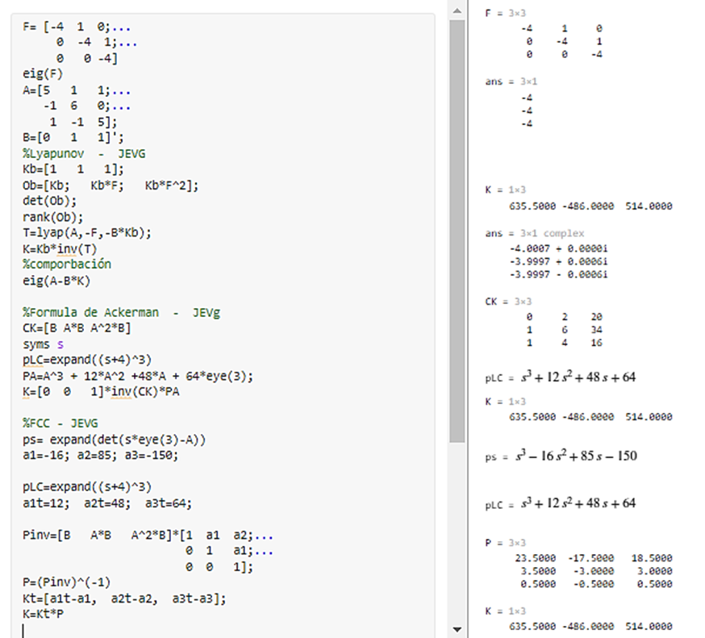
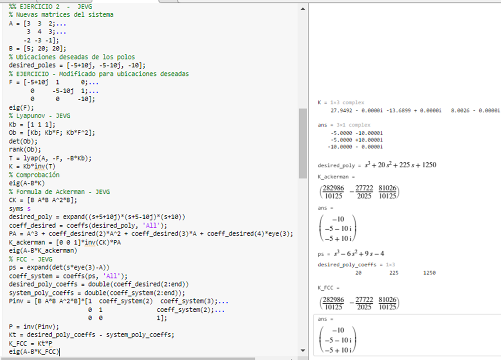
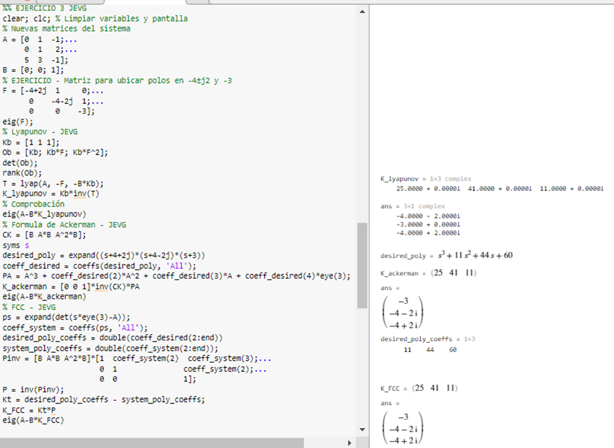
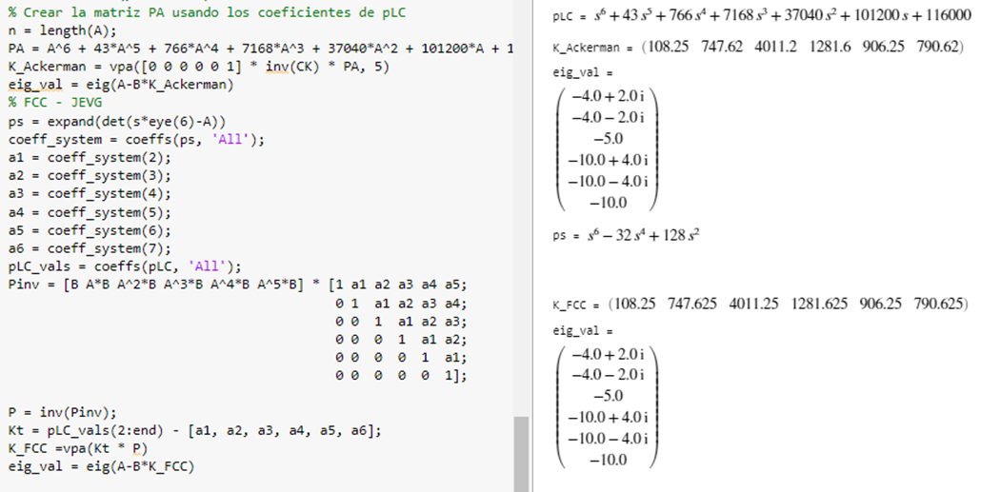

# Exercise in class 03/10: Location of poles by different methods

## Theoretical Explanation of Pole Placement Methods

### Lyapunov Method

The Lyapunov method for pole placement is based on solving the Lyapunov equation:

\[ A'X + XA = -Q \]

Where \( A' \) is the desired closed-loop system matrix, \( X \) is the solution to the Lyapunov equation, and \( Q \) is a positive definite matrix. The solution \( X \) is then used to calculate the state-feedback matrix \( K \) that places the poles of the closed-loop system at the desired locations specified by \( A' \).

In MATLAB, the `lyap` function can be used to solve the Lyapunov equation:

```matlab
T = lyap(A, -F, -B * Kb);
K = Kb * inv(T);
```
This will give us the matrix K that we can use for state-feedback such that the closed-loop system will have the desired pole locations.

For the systems of exercises 1 to 4 calculate the value of \( K \) to assign the desired dynamics by state feedback applying a different method for each case.

### Ackerman's Formula

Ackerman's formula is another method used for pole placement. It is given by:

$$ K = [0 \ldots 0 \ 1] \cdot \text{inv}(C_k) \cdot P_A $$

Where \( C_k \) is the controllability matrix, and \( P_A \) is a matrix that is derived from the characteristic polynomial of the desired closed-loop system. In MATLAB, this can be implemented as follows:

```matlab
CK = [B A*B A^2*B];
PA = A^3 + 12*A^2 + 48*A + 64*eye(3);
K = [0  0  1] * inv(CK) * PA;
```
The characteristic polynomial is obtained by the desired pole locations, and the matrix P_A is computed using the coefficients of this polynomial.


### Full-state Feedback Control (FCC)

The FCC method involves creating a new feedback matrix that will result in the closed-loop system having a characteristic polynomial that matches the desired characteristic polynomial. This method is closely related to the Lyapunov method and also makes use of the controllability matrix.

The steps for the FCC method in MATLAB include:

Compute the characteristic polynomial of the system **A** and the desired characteristic polynomial.
Calculate the inverse of a matrix constructed from the controllability matrix and the coefficients of the desired polynomial.
The state-feedback matrix **K** is then computed as the difference between the coefficients of the actual and the desired characteristic polynomials, post-multiplied by the inverse matrix obtained in step 2.

```matlab
ps = expand(det(s*eye(3)-A));
Pinv = [B A*B A^2*B] * [1 a1 a2; 0 1 a1; 0 0 1];
P = inv(Pinv);
Kt = [a1t-a1, a2t-a2, a3t-a3];
K = Kt * P;
```

***Each of these methods has its own advantages and is chosen based on specific criteria or constraints in a control design problem. The MATLAB functions such as lyap and symbolic computation capabilities allow for straightforward implementation of these methods.***


## 1. Locate all poles at: -4


   $$ \dot{x} = \begin{pmatrix} 5 & 1 & 1 \\ -1 & 6 & 0 \\ 1 & -1 & 5 \end{pmatrix} x + \begin{pmatrix} 0 \\ 1 \\ 1 \end{pmatrix} u $$




   $$ ( K, K_{\text{Ackerman}}, K_{\text{FCC}} ) = 1×3 $$

   `635.5000  -486.0000  514.0000`


   ## 2. Locate the poles at: -5±j10 y -10

   $$ \dot{x} = \begin{pmatrix} 3 & 3 & 2 \\ 3 & 4 & 3 \\ -2 & -3 & -1 \end{pmatrix} x + \begin{pmatrix} 5 \\ 20 \\ 20 \end{pmatrix} u $$



   **K** = 1×3 complex

   `27.9492 - 0.0000i  -13.6899 + 0.0000i  8.0026 - 0.0000i`

   **K_ackerman** =    
$$ \frac{282986}{10125}; - \frac{27722}{2025};  \frac{81026}{10125}
$$

   **K_FCC** = 
$$ \frac{282986}{10125}; - \frac{27722}{2025};  \frac{81026}{10125}
$$


   ## 3. Locate the poles at: -4 ± j2 y -3.

   $$ \dot{x} = \begin{pmatrix} 0 & 1 & -1 \\ 0 & 1 & 2 \\ 5 & 3 & -1 \end{pmatrix} x + \begin{pmatrix} 0 \\ 0 \\ 1 \end{pmatrix} u $$



   **K_lyapunov** = 1×3 complex

   `25.0000 + 0.0000i  41.0000 + 0.0000i  11.0000 + 0.0000i`

   **K_ackerman** = 

$$ (25;  41;  11)
$$

   **K_FCC** = 
$$ (25;  41;  11)
$$

  ## 4. Locate the poles at: -4 ± j2, -10 ± j4, -5 y -10.

   $$ \dot{x} = \begin{pmatrix}
   0 & 1 & 0 & 0 & 0 & 0 \\
   16 & 0 & -8 & 0 & 0 & 0 \\
   0 & 0 & 0 & 1 & 0 & 0 \\
   -16 & 0 & 16 & 0 & 0 & 0 \\
   0 & 0 & 0 & 0 & 0 & 1 \\
   0 & 0 & 0 & 0 & 0 & 0
   \end{pmatrix} x + \begin{pmatrix}
   0 \\ -1 \\ 0 \\ 0 \\ 0 \\ 1
   \end{pmatrix} u $$



   **K** = 1×6 complex

   `103 × (0.1082 + 0.0000i  0.7476 + 0.0000i  4.0112 + 0.0000i  1.2816 + 0.0000i  0.9062 + 0.0000i  0.7906 + 0.0000i)`

   **K_Ackerman** = 
$$ (108.25; 747.62; 4011.2; 1281.6; 906.25; 790.62)
$$
   **K_FCC** = 
$$ (108.25; 747.62; 4011.2; 1281.6; 906.25; 790.62)
$$

### Conclusion

The exercises presented focus on the design of state feedback based controllers for linear systems. The central idea is to determine a gain matrix (K) such that the poles of the closed system (system plus controller) are located at desired locations in the plane (s), which will guarantee a specific behavior of the system.

The methods presented (Lyapunov, Ackerman, and FCC) are standard and powerful techniques for state feedback based controller design.

It is important to emphasize that pole placement guarantees a desired behavior only for the plant modes that are controllable. Therefore, the controllability of the system is verified by calculating the rank and determinant of the observability matrix.

In all exercises, the desired poles of the closed system are correctly located, which indicates that the applied methods work properly.

It is relevant to always check the eigenvalues of the closed system to make sure that the poles are located in the desired positions.

Given the nature of the methods, it is common to obtain different gain matrices that achieve the same design objectives. That is, there are multiple valid solutions that satisfy the design criteria.

### Reference

Mata Machuca, J. L. (2024). Class presentations: Control of Mechatronic Systems. UPIITA, Instituto Politécnico Nacional. Ciclo escolar 2024-1.
